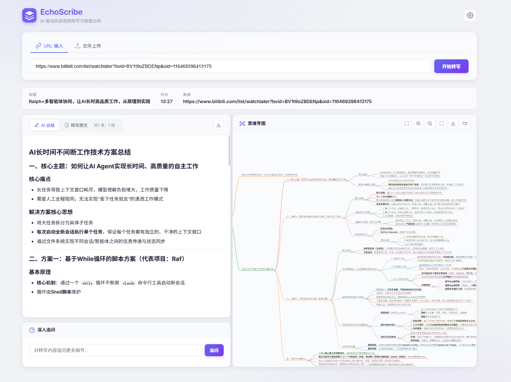
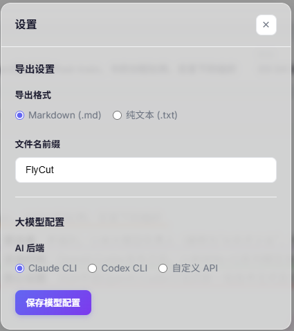

# EchoScribe - AI 音视频转写

基于 [FunASR](https://github.com/modelscope/FunASR) 的音视频转写 Web 应用，支持从 URL 或本地文件导入音视频，自动生成带时间戳的文字转写，并通过 Claude AI 进行智能摘要和问答分析。





## 功能特性

- **URL 转写**：粘贴视频/音频链接（支持 B站、YouTube、抖音等），自动下载并转写
- **文件上传**：直接上传本地音视频文件进行转写
- **AI 智能摘要**：基于转写文本生成结构化摘要，支持思维导图可视化
- **深度问答**：针对转写内容进行 AI 问答
- **视频播放**：在线播放源视频，点击时间戳跳转到对应位置
- **CLI 工具**：独立命令行脚本 `transcribe_url.py`，支持批量转写

## 环境要求

- Python 3.9 ~ 3.11
- [ffmpeg](https://ffmpeg.org/download.html)（需要在系统 PATH 中可用）
- [Claude Code CLI](https://docs.anthropic.com/en/docs/claude-code)（AI 摘要和问答功能需要）

## 安装步骤

### 1. 克隆项目

```bash
git clone https://github.com/fnmss/EchoScribe.git
cd EchoScribe
```

### 2. 创建并激活 Python 虚拟环境（可选）

**Windows：**

```bash
python -m venv venv
venv\Scripts\activate
```

**macOS / Linux：**

```bash
python3 -m venv venv
source venv/bin/activate
```

激活后终端提示符前会出现 `(venv)` 前缀。

> 不使用虚拟环境也可以，直接在系统 Python 中安装依赖即可。如果使用虚拟环境，后续的 Claude Code CLI 也需要在虚拟环境激活状态下安装，否则会找不到 `claude` 命令。

### 3. 安装 PyTorch（根据硬件选择）

PyTorch 需要根据你的硬件环境单独安装，请参考 [PyTorch 官网](https://pytorch.org/get-started/locally/) 选择合适的命令。

**CUDA（NVIDIA 显卡加速）：**

```bash
# 以 CUDA 12.1 为例，请根据实际 CUDA 版本调整
pip install torch torchaudio --index-url https://download.pytorch.org/whl/cu121
```

**CPU（无独立显卡 / macOS）：**

```bash
pip install torch torchaudio --index-url https://download.pytorch.org/whl/cpu
```

> macOS Apple Silicon 用户也可以使用 MPS 加速，安装 CPU 版本即可自动支持。

### 4. 安装项目依赖

```bash
pip install -r requirements.txt
```

### 5. 安装外部依赖

**ffmpeg：**

- Windows：从 [ffmpeg.org](https://ffmpeg.org/download.html) 下载，解压后将 `bin` 目录添加到系统 PATH
- macOS：`brew install ffmpeg`
- Linux (Debian/Ubuntu)：`sudo apt install ffmpeg`


安装后运行 `claude --version` 确认可用，并按提示完成认证。

## 使用方法

### Web 应用

```bash
# 确保虚拟环境已激活
python app.py
```

浏览器访问 `http://localhost:5000`，粘贴视频链接或上传文件即可开始转写。

### 命令行工具

```bash
python transcribe_url.py "https://www.bilibili.com/video/BVxxxxxxx"
```

常用参数：

```bash
# 指定输出文件
python transcribe_url.py "URL" -o output.txt

# 使用 GPU
python transcribe_url.py "URL" --device cuda

# 处理 B站多P视频
python transcribe_url.py "URL" --all-parts

# 指定浏览器 cookies（用于需要登录的视频）
python transcribe_url.py "URL" --cookies chrome
```

查看全部参数：

```bash
python transcribe_url.py -h
```

## 项目结构

```
.
├── app.py              # Flask Web 应用主程序
├── transcribe_url.py   # 命令行转写工具
├── requirements.txt    # Python 依赖
├── static/
│   ├── app.js          # 前端 JavaScript
│   └── style.css       # 前端样式
└── templates/
    └── index.html      # 页面模板
```

## 常见问题

**Q: 首次运行很慢？**

A: 首次启动会自动下载 FunASR 模型文件（约 1~2 GB），请确保网络通畅。模型会缓存到本地，后续启动无需重新下载。

**Q: 转写提示 ffmpeg 找不到？**

A: 请确认 ffmpeg 已正确安装并在系统 PATH 中。终端运行 `ffmpeg -version` 应能正常输出版本信息。

**Q: 如何使用 GPU 加速？**

A: 安装 CUDA 版 PyTorch 后，启动 Web 应用时会自动检测并使用 GPU。CLI 工具可通过 `--device cuda` 参数指定。

## 许可证

本项目仅供学习和个人使用。FunASR 模型的使用请遵循 [FunASR 许可协议](https://github.com/modelscope/FunASR/blob/main/LICENSE)。
